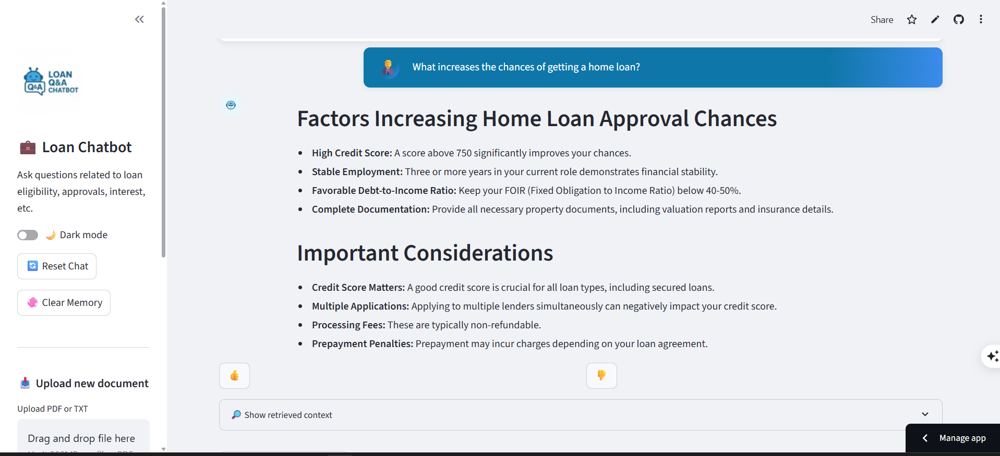

# Smart Loan Q&A Chatbot

An intelligent RAG-powered chatbot for loan-related queries, built with Streamlit, FAISS, and Google's Gemini LLM.

## Live Demo: [Smart Loan Q&A Chatbot](https://loan-lattice.streamlit.app/)

## Features

- **RAG Architecture**: Retrieval-Augmented Generation for accurate, context-aware responses
- **Multi-language Support**: 30+ languages including English, Hindi, Bengali, and more
- **Document Upload**: Upload PDF/TXT files to enhance knowledge base
- **Voice Input**: Speech-to-text functionality for hands-free interaction
- **Dark/Light Mode**: Toggle between themes for better user experience
- **Chat Memory**: Maintains conversation context across sessions
- **Feedback System**: Rate responses to improve future interactions
- **Export Conversations**: Download chat history as text files

## Technology Stack

- **Frontend**: Streamlit
- **LLM**: Google Gemini 1.5 Flash
- **Vector Database**: FAISS
- **Embeddings**: all-MiniLM-L6-v2 (Sentence Transformers)
- **Document Processing**: PyMuPDF for PDFs
- **Memory**: LangChain ConversationBufferMemory

## Project Structure

```
RAG-QandA-chatbot/
├── app.py                 # Main Streamlit application
├── src/                   # Core modules
│   ├── embedder.py       # FAISS index creation
│   ├── retriever.py      # Document retrieval
│   ├── generator.py      # LLM integration
│   ├── pdf_reader.py     # Document processing
│   ├── preprocess.py     # Data preprocessing
│   └── chat_memory.py    # Conversation memory
├── data/                  # Dataset files
│   ├── loan_data.csv.csv
├── docs/                  # Domain knowledge
│   ├── comprehensive_loan_guide.txt
│   └── notes.txt
├── embeddings/           # FAISS index storage
│   ├── index.faiss
│   └── index.pkl
├── assets/               # Application assets
│   ├── logo.png
│   ├── image.png
│   ├── image-1.png
│   └── image-......
├── .streamlit/           # Streamlit configuration
│   └── config.toml
├── requirements.txt      # Dependencies
├── README.md            # Project documentation
├── approach.md          # Technical approach
├── output.txt           # Sample conversations
└── .gitignore          # Git ignore rules
```

## Screenshots





## Quick Start

### Prerequisites

- Python 3.8+
- Google API Key for Gemini

### Installation

1. **Clone the repository**
   ```bash
   git clone <repository-url>
   cd RAG-QandA-chatbot
   ```

2. **Install dependencies**
   ```bash
   pip install -r requirements.txt
   ```

3. **Set up environment variables**
   Create a `.env` file in the project root:
   ```
   GOOGLE_API_KEY=your_gemini_api_key_here
   ```

4. **Build the FAISS index**
   ```bash
   python src/embedder.py
   ```

5. **Run the application**
   ```bash
   streamlit run app.py
   ```

## Usage

1. **Ask Questions**: Type loan-related questions in the chat interface
2. **Upload Documents**: Add PDF/TXT files via the sidebar to enhance knowledge
3. **Voice Input**: Click the microphone button for speech input
4. **View Context**: Expand "Show retrieved context" to see source documents
5. **Export Chat**: Download conversation history as text file

### Example Questions

- "What are the current home loan interest rates?"
- "Why was my loan rejected even with good income?"
- "Is credit history important for loan approval?"
- "What increases the chances of getting a home loan?"

## Configuration

### Environment Variables

- `GOOGLE_API_KEY`: Required for Gemini LLM access
- `JUDGE0_API_KEY`: Optional for code execution features

### Customization

- **Embedding Model**: Change `EMBED_MODEL` in `src/retriever.py`
- **Chunk Size**: Modify `CHUNK_SIZE` in `src/embedder.py`
- **Languages**: Add/remove languages in the sidebar dropdown

## Performance

- **Response Time**: 2-5 seconds per query
- **Accuracy**: High relevance through RAG architecture
- **Scalability**: FAISS enables fast similarity search
- **Memory**: Efficient conversation management

## Contributing

1. Fork the repository
2. Create a feature branch
3. Make your changes
4. Test thoroughly
5. Submit a pull request

## Acknowledgments

- Google Gemini for LLM capabilities
- FAISS for efficient vector search
- Streamlit for the web interface
- Sentence Transformers for embeddings